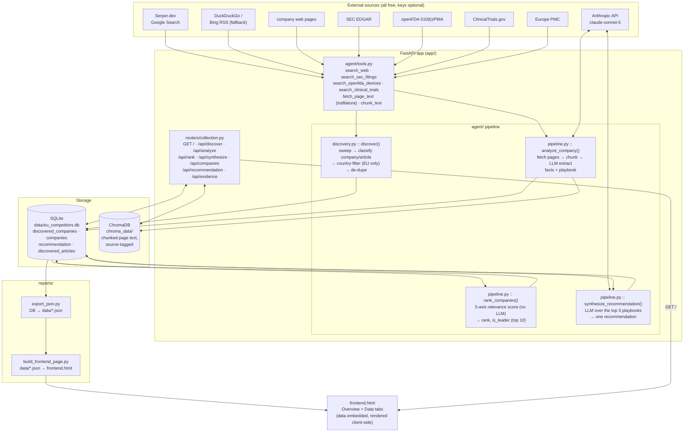

# Proteins.1 — EU Platform-Competitor Landscape

An AI data-collection service that maps the **European companies building a
Proteins.1-type platform** — physics/affinity-driven single-molecule or
ultra-sensitive protein detection, enzyme-free signal amplification,
single-molecule protein sequencing or sizing.

It runs a four-step pipeline — **discover → analyse → rank → synthesise** — and
serves a single-page frontend at `GET /` with two tabs:

- **Overview** — answers three questions: who leads the field (top 10 by
  relevance score), what made the top 3 succeed, and the consolidated
  application + go-to-market route for Proteins.1.
- **Data** — the full census, every analysed company with its playbook and
  score, and every background article, all searchable.

Out of scope: ctDNA / genomic liquid biopsy, antibody / reagent suppliers, CROs,
and non-European companies (dropped at store time).

---

## Architecture



**Flow.** `discover()` sweeps ~30 curated web queries, keeps hits that look like a
company (not a publisher/institution), drops anything not resolvably European,
and writes the **census** (`discovered_companies`). `analyze_company()` takes one
company, fetches its own pages plus any SEC / openFDA / trial records, stores the
raw text in **Chroma**, and makes two LLM calls — one to extract structured facts
from each page, one to synthesise a **playbook** (leader, success factors,
suggestions for Proteins.1) — into a `companies` row. `rank_companies()` scores
every `companies` row with a **fixed formula, no LLM**:

```
relevance = 2·platform + 1.5·stage + 1.5·route + 1·evidence + 1·ecosystem     (max 32.5)
```
and flags the top 10 `is_leader`. `synthesize_recommendation()` makes one more
LLM call over the three highest-scoring playbooks to produce the single
consolidated recommendation shown in the Overview.

`reports/export_json.py` dumps the DB to `reports/data/*.json`;
`reports/build_frontend_page.py` embeds those into `frontend.html`, which the app
serves at `GET /`.

---

## How to run

### 1. Prerequisites

- **Python 3.9+** (macOS system `python3` is fine; the Docker image uses 3.11)
- Optional keys (the app runs without them, with reduced quality):
  - `ANTHROPIC_API_KEY` — required for `analyze_company` / `synthesize_recommendation` (the LLM steps). Without it, facts and playbooks come back empty.
  - `SERPER_API_KEY` — Google Search via [serper.dev](https://serper.dev) (free tier 2,500 queries). Without it, web search falls back to DuckDuckGo/Bing, which rate-limit heavily.
  - `SEC_USER_AGENT` — `"Name email@example.com"`; SEC EDGAR requires it for filing access.

### 2. Setup

```bash
python3 -m venv venv                      # macOS/Linux: use python3 (there is no `python`). Windows: py -m venv venv
source venv/bin/activate                  # Windows: venv\Scripts\activate
pip install -r requirements.txt
cp .env.example .env                      # then edit .env and add your keys
```

Every `python ...` / `pip ...` command below assumes this venv is **activated**
(the venv provides a bare `python`); otherwise substitute `python3`.

### 3. Run the API + frontend

```bash
uvicorn app.main:app --reload
```

- Frontend: <http://localhost:8000/>
- Interactive API docs: <http://localhost:8000/docs>
- Health check: <http://localhost:8000/health>

On startup the app creates `data/eu_competitors.db` if missing. The frontend
shows whatever is currently in `reports/frontend.html` (committed with the repo);
regenerate it after a new collection run (step 5).

### 4. Run a full collection (populates the DB)

```bash
PYTHONPATH=. python3 scripts/collect.py            # discover → analyse (≤16 companies) → rank → synthesise
PYTHONPATH=. python3 scripts/collect.py 8          # cap analysis to 8 companies (fewer LLM/API calls)
```

Cost per full run: ~30 Serper credits for discovery + ~1 per analysed company,
and ~13 Anthropic calls per analysed company. Expect 20–40 min for the default 16.
Chroma downloads an ~80 MB embedding model on the first run (one-time, cached).

Or drive it endpoint by endpoint:

```bash
curl -X POST localhost:8000/api/discover -H 'content-type: application/json' -d '{}'
curl -X POST localhost:8000/api/analyze  -H 'content-type: application/json' -d '{"company_name":"Refeyn"}'
curl -X POST "localhost:8000/api/rank"      -H 'content-type: application/json' -d '{"top_n":10}'
curl -X POST "localhost:8000/api/synthesize?top_k=3"
curl localhost:8000/api/companies?leaders_only=true
```

### 5. Refresh the frontend after a run

```bash
python reports/export_json.py             # DB  → reports/data/*.json
python reports/build_frontend_page.py     # JSON → reports/frontend.html   (served at GET /)
```

### 6. Docker

```bash
cp .env.example .env                      # add your keys
docker compose up --build
```

`data/`, `chroma_data/` and `reports/` are bind-mounted, so the DB, the vector
store, and a regenerated `frontend.html` persist and update without an image
rebuild. Run a collection inside the container with:

```bash
docker compose exec backend python -m scripts.collect
```

---

## Data model (`data/eu_competitors.db`)

| Table | What |
|---|---|
| `discovered_companies` | The census. One row per European platform company: `name, domain, country, platform_type, description, mention_count, analysed`. Keyed by domain; repeat sweeps de-duplicate. |
| `companies` | An **analysed** company: structured facts (`what_they_do, technology_approach, detection_modality, sensitivity_claim, sample_requirement, target_applications[], stage, funding_summary, key_partnerships[], differentiators[]` — from its own pages, never guessed), the **playbook** (`leader_name/role/background, why_worth_studying, success_factors[], application_suggestions[], market_route_suggestions[], route_summary, confidence`), and the **relevance score** (`score_platform/stage/route/evidence/ecosystem, score_notes, relevance_score, rank, is_leader`). |
| `recommendation` | Single row. The consolidated `headline`, `applications[]`, `market_route[]`, `sequence` for Proteins.1, synthesised from the top-3 playbooks. |
| `discovered_articles` | Background papers / news / filings on the technology field. |

Raw page text is chunked into ChromaDB (`chroma_data/`), source-tagged, for
semantic lookup via `POST /api/evidence`.

## Endpoints

| Method | Path | |
|---|---|---|
| GET | `/` | The frontend (Overview + Data tabs). Serves `reports/frontend.html`. |
| POST | `/api/discover` | Landscape sweep. Body optional: `{"extra_terms":[...], "per_query":8, "max_queries":6}`. ~1 Serper credit per query. |
| GET | `/api/discovered-companies` | The census. `?country=`, `?platform_type=`, `?analysed=`. |
| GET | `/api/discovered-articles` | `?domain=`. |
| POST | `/api/analyze` | `{"company_name":"Refeyn", "urls":[]}` — fetch pages, extract facts, synthesise the playbook into a `companies` row. |
| POST | `/api/rank` | `{"top_n":10}` — score every analysed company; flag the leaders. |
| GET | `/api/companies` | The analysed companies, by rank. `?leaders_only=true`, `?country=`. |
| POST | `/api/synthesize` | `?top_k=3` — build the consolidated recommendation from the top-k playbooks. |
| GET | `/api/recommendation` | The consolidated recommendation (Overview Q3). |
| POST | `/api/evidence` | `{"query":"...", "company":"Refeyn", "n_results":3}` — semantic search over the raw collected text. |

## Layout

```
app/
  main.py            FastAPI app: GET / (frontend) + startup init_db()
  config.py          env vars + store paths
  database.py        SQLite models: DiscoveredCompany, Company, Recommendation, DiscoveredArticle
  schemas.py         Pydantic request/response models
  chroma_store.py    embedded ChromaDB wrapper (add_chunks / query_evidence)
  agent/
    tools.py         search_web (Serper + no-key fallbacks), SEC / openFDA / ClinicalTrials, fetch_page_text
    discovery.py     EU platform-company sweep: search → classify → country-filter → de-dupe
    pipeline.py      analyze_company · rank_companies · synthesize_recommendation
  routers/
    collection.py    all HTTP endpoints
reports/
  build_frontend_page.py   data/*.json  → frontend.html   (served at GET /)
  export_json.py           DB           → data/*.json
  data/*.json              committed snapshot the frontend embeds
scripts/
  collect.py               end-to-end run: discover → analyse → rank → synthesise
```

## Ground rules

- **No fabricated facts.** The extraction prompts return `null` / `[]` rather than
  guessing when something isn't in the source text. The relevance score and the
  recommendation are the only analytical parts, and they are clearly labelled as
  such in the frontend.
- **Every `companies` row keeps its `source_urls`.**
- **European only.** `discovery.py` drops hits whose country resolves to a
  non-European location or that match a known non-EU domain; undetermined-country
  hits are kept with `country=""` for a human to prune.
